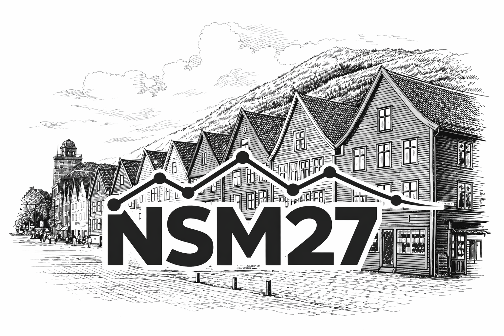

{width=100%}

**Velkommen til Norsk Statistikermøte, 14.-17. juni 2027 i Bergen!**

Statistikermøtet samler statistikkmiljøet i Norge til faglig program, bidrag fra
deltakerne og sosialt samvær. Møtet holdes i Bergen, med forkurs i forkant.

## Viktige datoer

- **14.–15. juni 2027** – forkurs (lunsj til lunsj)
- **15.–17. juni 2027** – Norsk Statistikermøte 
- Påmelding og abstract-innsending åpner senere – følg med her.

## Programkomité

Programkomiteen består foreløpig av:

- Svein Olav Nyberg (UiA)
- Yushu Li (UiB)
- Sondre Hølleland (NHH)

Flere medlemmer kommer.

## Organisasjonskomité

- Bård Støve (UiB)
- Anne Marie Fenstad (NRL)
- Birgitte Espehaug (HVL)
- Geir Drage Berentsen (NHH)
- Sondre Hølleland (NHH)
- Eirik Myrvoll-Nilsen (UiT)
